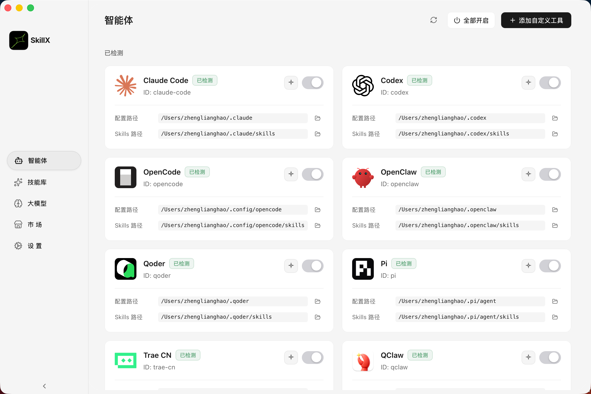
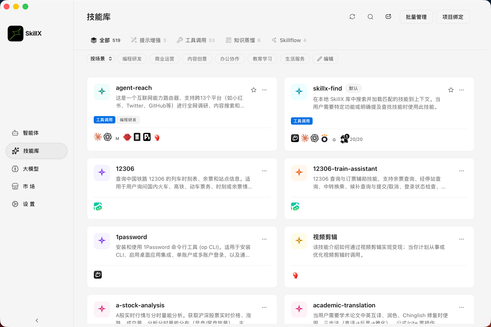
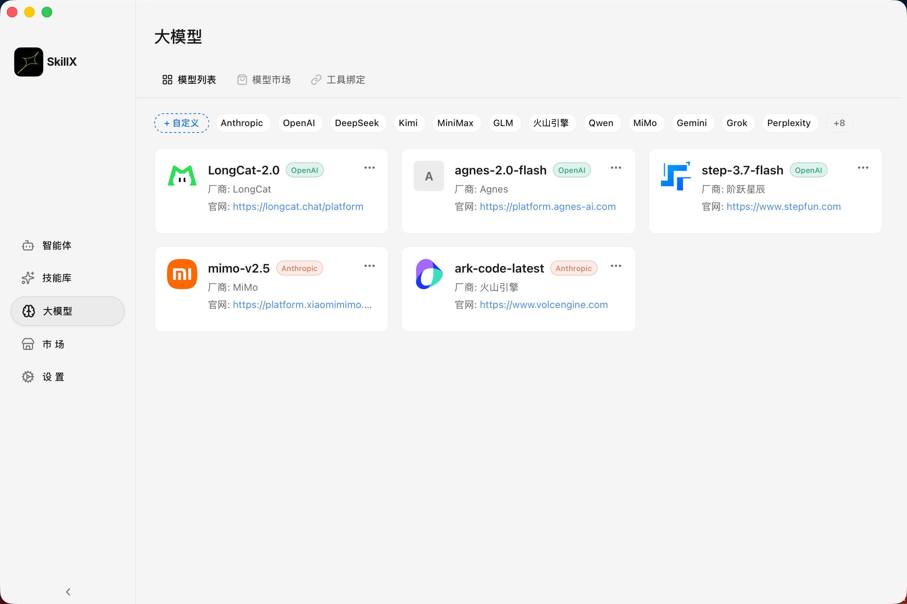
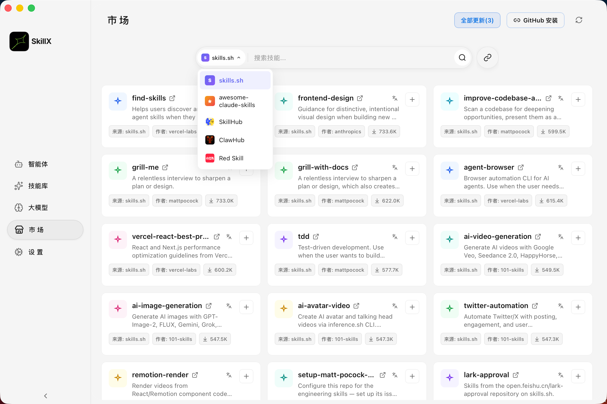

# SkillX

  

> **一款统一的 AI 编码助手技能管理桌面应用。**
> 一处编写，处处可用：**Claude Code、Codex、Gemini、Cursor、Cline** 等 20+ AI 工具通用。

  

[English](./README.md) · [Changelog](./CHANGELOG.md)

## 📖 简介

**SkillX** 是一款现代化桌面应用，解决 AI 助手技能配置碎片化的问题。不再需要为不同工具分别管理技能——SkillX 通过 **软链接** 机制自动同步，你只需编写一次，即可在所有支持的工具中即时使用。

## ✨ 核心特性

- **🎯 统一管理**：所有 AI 技能集中在一个位置。
- **🔄 软链接同步**：自动、无文件复制、始终最新。
- **🎛️ 精细控制**：为不同工具单独启用/禁用技能，不删除原始文件。
- **🌐 多语言显示**：技能名称与简介支持原始 / 中文 / 英文独立配置，支持一键 AI 翻译。
- **🏪 模型市场**：内置 20+ LLM Provider（OpenAI、Anthropic、DeepSeek、Qwen、Kimi、GLM、Gemini、Grok、MiniMax 等）。
- **🔗 工具绑定**：把 Provider 绑定到具体工具，一键切换模型。
- **⚡ 高性能**：Rust + Tauri 2.0；配置缓存加速响应。
- **🔌 多工具支持**：Claude Code、Codex、Gemini、Cursor、Cline、Kiro、Trae、Iflow、Qwen Code、Hermes、Opencode 等，同时支持自定义工具。
- **🎨 现代界面**：React 19 + Tailwind CSS v4 + Radix UI；内置 5 组主题（明暗共 10 套）。

## 📸 界面预览

### 🛠️ 智能体管理 — 一键识别本机所有 AI 工具

自动检测已安装的 AI 编码工具，显示配置目录和技能路径。内置工具按目录识别，自定义工具支持任意路径。新启用的工具还会自动补全默认技能链接。

  

### 📚 技能库 — 所有技能集中管理

所有技能存放在统一的 Hub 目录，通过软链接同步到每个已启用的工具。卡片上直接显示当前启用了哪些工具，一键开关或跳到编辑器。

  

### 🤖 大模型市场 — 20+ LLM Provider 即开即用

同时管理多个 LLM Provider（OpenAI、Anthropic、DeepSeek、Qwen、Kimi、GLM、Gemini、Grok、MiniMax、火山引擎、StepFun 等），指定一个为当前激活，并可绑定到具体工具。支持任意 OpenAI 兼容协议的自定义 Provider。

  

### 🏪 技能市场 — 发现并安装新技能

汇聚多个精选来源（`skills.sh`、`awesome-claude-skills`、`ClawHub`、`SkillHub`、`Red Skill`），一键安装。筛选和搜索帮助你在数千个社区技能里快速找到需要的那一个。

  

## 📥 下载

从 **[发布页面](../../releases)** 下载最新版本安装包。

| 操作系统 | 安装包 | 状态 |
|----------|--------|------|
| **macOS**（Apple Silicon） | `.dmg` (aarch64) | ✅ 可用 |
| **Windows** | `.msi` / `.exe` | 🔜 即将支持 |
| **Linux** | `.deb` / `.AppImage` / `.rpm` | 🔜 即将支持 |

> 🪟 **Windows / Linux**：v3.4.0 目前仅发布 macOS 版本，Windows 与 Linux 安装包将于后续版本提供。

## 🚀 快速开始

1. **安装**：运行 macOS 安装包。
2. **设置**：首次启动时，应用会引导你选择技能存储目录。
3. **同步**：应用自动检测已安装的 AI 工具并链接技能。

## 🛠️ 技术栈

- **核心**：[Tauri 2.0](https://tauri.app/) (Rust)
- **前端**：[React 19](https://react.dev/) + TypeScript
- **样式**：[Tailwind CSS v4](https://tailwindcss.com/)
- **UI 组件**：[Radix UI](https://www.radix-ui.com/)
- **编辑器**：[Monaco Editor](https://microsoft.github.io/monaco-editor/)

## 📅 更新亮点

### v3.4.0（2026-07-03）
- **主题系统**：新增 5 组主题（Apple / Comic / Cyberpunk / Default / Neumorphism），明暗共 10 套
- **工具绑定**：把 LLM Provider 绑定到具体工具，一键切换模型
- **多 Provider 管理**：并列管理多个 Provider，可标记当前激活

### v3.3.1（2026-07-01）
- **AI 技能管家**：统一入口整合 AI 批量翻译与 AI 分类
- **批量操作增强**：批量分类、批量标签、批量删除、绑定智能体
- **稳定性**：Anthropic 认证头修复、OpenAI `response_format` 修复、Tauri 2 错误格式解析修复

### v3.2.x（2026-06-23 ~ 06-26）
- **模型市场**：20+ 内置 Provider、智能图标匹配、自定义 Provider
- **Hermes profiles 检测**、玻璃拟态 UI、翻译缓存统一
- Skills.tsx 拆分：3,819 → 2,525 行（-34%）

### v3.0.0（2026-06-16）
- 多语言显示 + 一键翻译
- 安全加固（路径校验、CSP、URL 校验）
- 配置缓存，首次以社区开源版本发布

> 完整历史：**[CHANGELOG.md](./CHANGELOG.md)**

## 🙏 致谢

SkillX 是 **[Skills Manager](https://github.com/jiweiyeah/Skills-Manager)** 的 fork 项目，由 [jiweiyeah](https://github.com/jiweiyeah) 原创。衷心感谢原作者及所有贡献者打下的坚实基础。

## 🤝 贡献与反馈

- **发现 Bug**：请在 [Issues](../../issues) 提交问题。
- **功能建议**：欢迎在 [Issues](../../issues) 讨论。
- **贡献指南**：参见 [CONTRIBUTING.md](./CONTRIBUTING.md)。

## 📈 Star 历史

---

*为 AI 开发者社区用心打造 ❤️*
